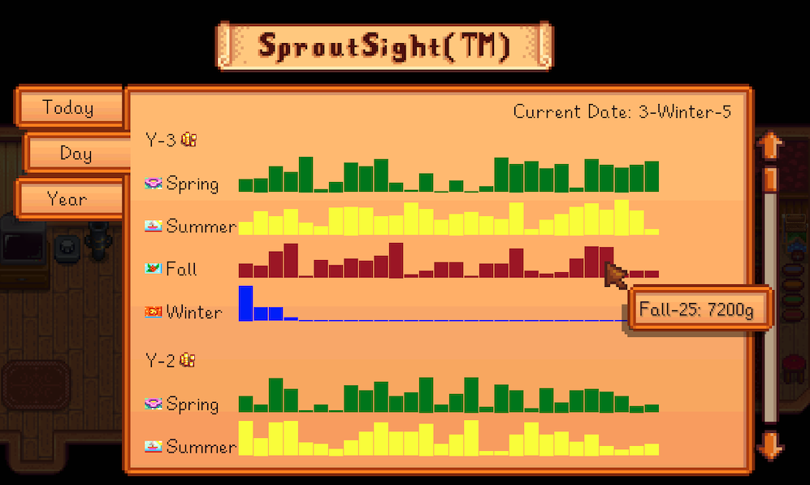

# SproutSight Pro&trade;

SproutSight Pro&trade; allows you to track and analyze your shipping data in for your farm with an easy-to-use interface brought to you by SproutSight Pro &trade;. SproutSight Pro&trade; mod saves your shipping data to CSV files and provides an in-game viewer to analyze your farming profits in the SproutSight Pro&trade; UI.

**Download on [Nexus Mods](https://www.nexusmods.com/stardewvalley/mods/31705/)** \
**Source on [Github](https://github.com/24v/SproutSight)**



## Features
- 📊 **Detailed Shipping Records**: Tracks all items shipped through both main shipping bin and mini-shipping bins
- 📈 **Visual Statistics**: View your shipping history with daily, seasonal, and yearly breakdowns
- 💰 **Real-time Tracking**: See currently shipped items and their total proceeds
- 📁 **CSV Export**: All data is saved in CSV format (at the end of the day) for easy external analysis
- ⚙️ **Configurable Interface**: Access via hotkey (default: F8) or optional HUD icon
- ️⭐ **Star Control Support**: Integrated with StarControl for easty controller setup

## Usage
- Press F8 (configurable) or click the shipping bin icon in the HUD to open the statistics viewer
- The mod automatically tracks all items you put in shipping bins and save the data at the end of the day.
- CSV files are saved as "[FarmName]_[SaveID].csv" in the mod directory
```
Stardew Valley/Mods/SproutSight/data/[FarmName]_[SaveID].csv
```

## Installation
1. Install [SMAPI](https://smapi.io/) (4.0.0 or later)
2. Install [StardewUI](https://www.nexusmods.com/stardewvalley/mods/TODO) (0.6.0 or later)
3. Download this mod from [Nexus Mods](TODO: Add nexus link)
4. Unzip the mod into your `Stardew Valley/Mods` folder
6. Ship stuff
7. ???
8. Profit

## Configuration
Use [Generic Mod Config Menu](https://www.nexusmods.com/stardewvalley/mods/5098) to configure:
- Toggle HUD icon visibility
- Change the hotkey to open statistics viewer

## Compatibility
- Tested on Stardew Valley 1.6.15
- Tested on SMAPI 4.1.10
- Tested on StardewUI 0.6.0
- Not yet tested in multiplayer environments

## File Format
The shipping data is saved in CSV format with the following columns:
- PlayerName
- FarmName
- SaveDate
- Year
- SeasonId
- SeasonName
- Day
- ItemId
- ItemName
- QualityId
- Quality
- StackCount
- SalePrice
- CategoryId
- CategoryName

## Credits
- Inspired by (and some code taken) from [Iceburg333's Shipment Tracker](https://www.nexusmods.com/stardewvalley/mods/321)
- StardewUI for making this easy.

## Feedback and Support
Feedback and comments appreciated.
- Create an issue on [GitHub](TODO: Add github link)
- Find me (https://discord.com/users/malcier) on the [Stardew Valley Discord](https://discord.gg/stardewvalley)

## See also
- [Changelog](CHANGELOG.md)

## License
MIT License - Feel free to use and modify this mod as you see fit.
